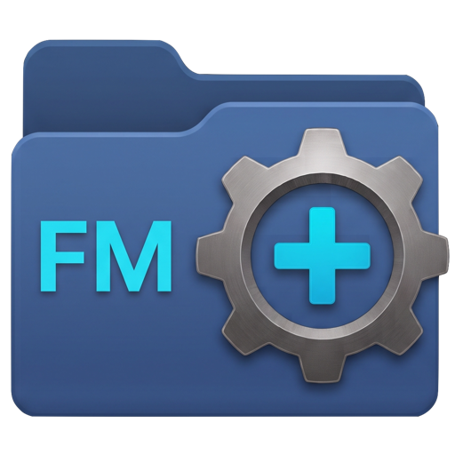
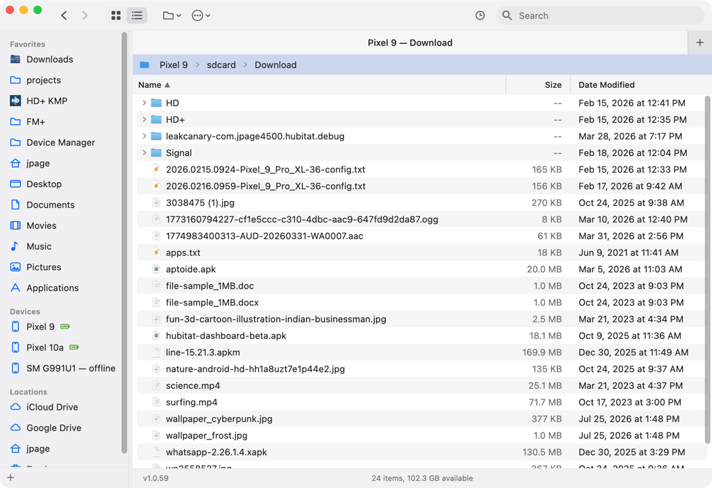
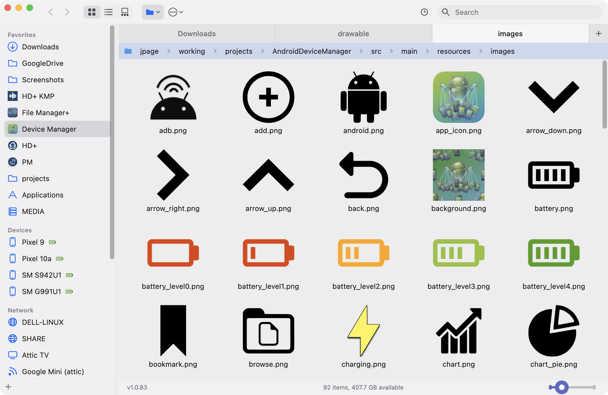
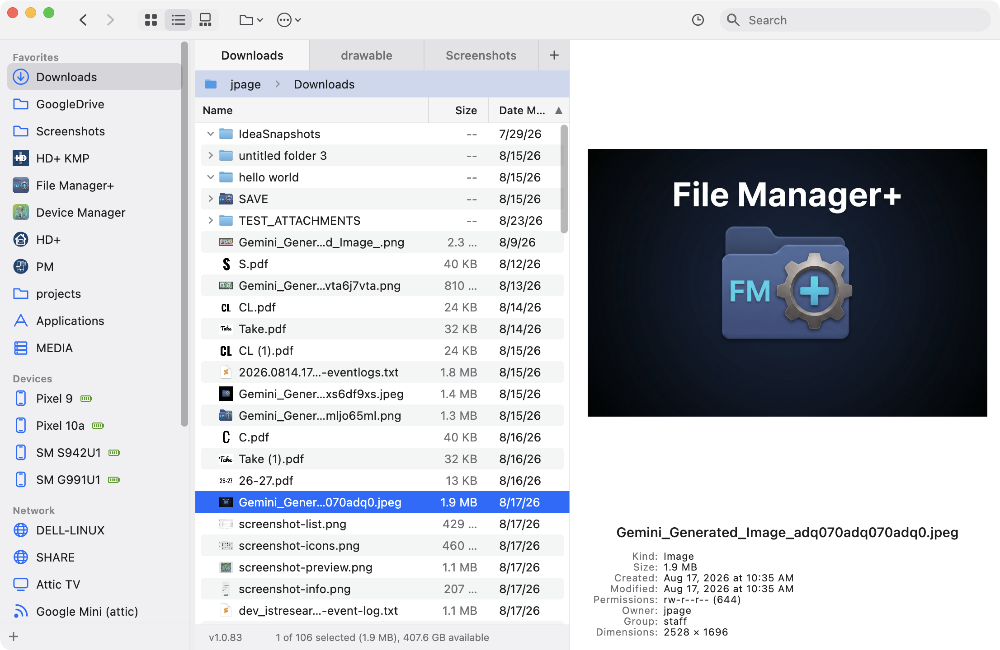
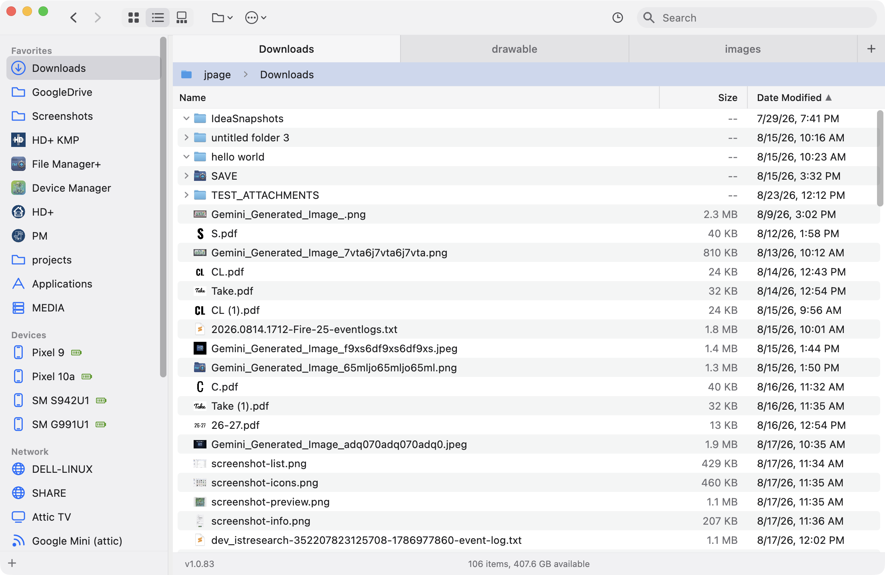
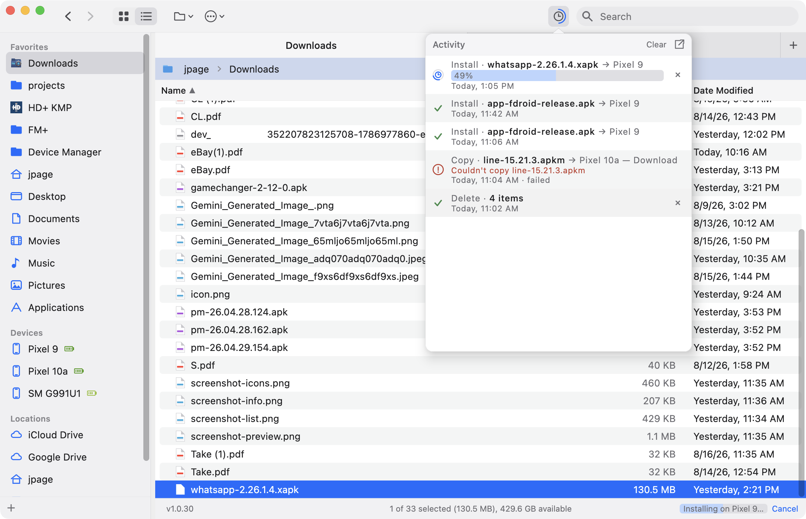
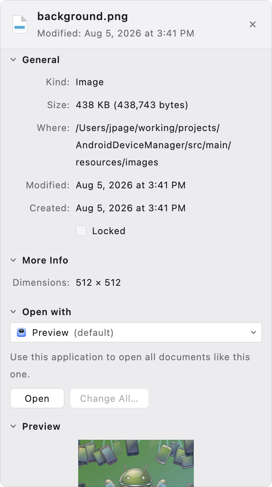
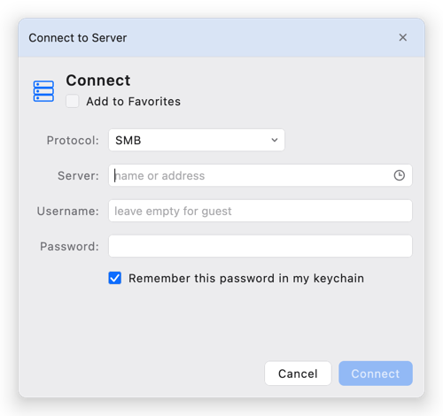

<div align="center">



# File Manager+

**A modern, fast, developer-friendly file manager for macOS, Windows and Linux.**

[](https://github.com/jpage4500/FileManagerPlus/releases/latest)
&nbsp;


<br>



</div>

---

## Why you might like it

There's **plenty** of file managers out there, including one built into your OS (macOS Finder, Windows File Explorer). I've tried several and the best one were either pricey or required a subscription model which adds up and is hard to justify. The free/open source ones never really worked the way I wanted them to - many times they have an outdated UI or have just been around for so long they've gotten overly complex to use.

I wanted a File Manager that I will actually use every day. It needs to be **FAST**, **keyboard friendly** and have a **modern UI**. I'm also a developer so there's several developer friendly features that I wanted. But, they shouldn't get in the way for non-developers or slow down the app.

---

## About Me

I've been a developer for 20+ years. I am passionate about the products I work on and work to make them the best in class any way that I can. AI has undoubtedly changed the programming landscape forever, and I'm embracing it head-on. I know what I want in an app and AI allows me to get there 1000 times faster than doing it myself. While that also means anyone can create an app from scratch today, I know what features should look like, how to provide excellent support, and how to keep the code from getting unmanageable. I will NEVER release any AI SLOP. Software can work differently for different people so maintaining it is critical for making it last.

---

## Standard Features

Every file manager copies, renames and deletes files. Most of them have these standard features too but here they are anyway:

|                                |                                                                                                                                                           |
|--------------------------------|-----------------------------------------------------------------------------------------------------------------------------------------------------------|
| **Tabs**                       | ⌘T, reorder by dragging, ⌘1–9 to jump, and they come back after a restart                                                                                 |
| **Expand in place**            | Unfold a folder inside the list to compare two subfolders without losing your place                                                                       |
| **Icon view**                  | Real thumbnails for images and PDFs, with a zoom slider                                                                                                   |
| **Favorites**                  | Drag folders in from the list or the breadcrumb, drop them between rows, rename in place, group them into collapsible sections                            |
| **Locations**                  | Home, drives, shares, iCloud Drive, Google Drive, the network and the Trash — updating live as drives come and go, each with an eject button              |
| **Get Info**                   | ⌘I — size, kind, dates, an editable permissions grid (checkboxes or octal), owner, group, and the macOS lock flag                                         |
| **Open With**                  | Every app that can open the file, "Other…" for anything else on the machine, and Change All to set the default for that type                              |
| **Conflicts**                  | Replace / Keep Both / Skip / Stop with "apply to all", both files shown side by side, and every question asked before anything is written                 |
| **Go to Folder**               | ⇧⌘G — type a path, Tab completes it, matching subfolders listed as you go                                                                                 |
| **Filter, sort, hidden files** | ⌘F narrows the folder ("114 of 290 items"), sorting keeps folders on top and sorts numbers naturally (`file2` before `file10`), ⇧⌘. shows the hidden ones |

## Advanced Features

Not every File Manager I've tested has these features - but they're what I consider **essential** to a polished / full-featured File Manager.

|                          |                                                                                                                               |
|--------------------------|-------------------------------------------------------------------------------------------------------------------------------|
| **Go to Folder**         | ⇧⌘G — type a path, Tab auto-completes it, matching subfolders listed as you go                                                |
| **Quick Open**           | Quickly open any favorite folder, device or run any application with a keystroke (⌘/)                                         |
| **Preview**              | Space for images, PDFs and text; the text is real text you can select and copy, and ← / → step through the folder             |
| **Per-folder views**     | Pin a view and its icon size to one folder — Photos can open as icons while everything else stays a list                      |
| **Live Refresh**         | Files added, renamed or deleted by another app show up automatically                                                          |
| **Open in Terminal**     | ⌥⌘T opens the current folder in your terminal of choice                                                                       |
| **Copy Path**            | ⌥⌘C copies the current folder or file path to the clipboard                                                                   |
| **Undo**                 | ⌘Z undoes the last action (ie: move/delete/rename)                                                                            |
| **Real image icons**     | Shows the **real icons** for images and PDFs, rather than generic document icons                                              |
| **Default app icons**    | Shows the associated app which opens the file as it's icon. Quickly tell that your .txt file opens in Sublime Text            |
| **Connect to Server**    | ⌘K — SMB, AFP, NFS and WebDAV. The OS does the mounting, so a share behaves exactly like a local folder everywhere in the app |
| **Reconnect in a click** | Save a server to Favorites; clicking it mounts the share again                                                                |
| **Share picker**         | Type just a server name and pick from the shares it offers                                                                    |
| **Themes**               | Offers many pre-built themes to customize all parts of the app                                                                |
| **Custom Theme Support** | Don't like a pre-build theme? Define your own!                                                                                |
| **Customize Keyboard**   | Customize almost every keyboard shortcut                                                                                      |

## Developer Features

You don't have to be a developer to use these - but as a developer these are the features I wanted specifically. Most File Managers I've used don't have these features

|                            |                                                                                                                 |
|----------------------------|-----------------------------------------------------------------------------------------------------------------|
| **Browse Android Devices** | Connect an Android phone and it shows up in the sidebar. Browse/Manage/Preview files. View device battery level |
| **Install an app**         | Drag an `.apk` (or `.xapk, .apkm, .apks`) to the device and it installs                                         |
| **Browse archives**        | Double-click a `.zip` — or supported archive format — and its contents *are* browsable like any other folder    |
| **Activity / History**     | View a record of all file operations, including copy, move, delete, install, extract and undo                   |

---

## Screenshots

<div align="center">

| Icon view with thumbnails                                                                | Quick preview                                                                           |
|------------------------------------------------------------------------------------------|-----------------------------------------------------------------------------------------|
|                    |             |
| **Connected Android Devices**                                                            | **Activity**                                                                            |
|  |                 |
| **Get Info**                                                                             | **Connect to Server**                                                                   |
|                |  |

</div>

---

## Pricing

**$14.95 once — and every future update is included.** No subscription, no renewal.

Try it free for **14 days**, all features, no payment details needed. After that it keeps working as
a file browser, and a license unlocks changing files again (copy, move, rename, delete, install).

[**Buy a license — $14.95**](https://buy.polar.sh/polar_cl_FVmqDr8khgY1sATlhLRGVjOLIQZEP3K6dUpIU1AtPIk)

One license covers **3 computers** you own. Your key arrives by email and goes into
**Settings ▸ About ▸ License**. Sold by Joe Page Software; payment is handled by
[Polar](https://polar.sh) as merchant of record. Refunds within 30 days, no reason needed — see
**[Store Policies](POLICIES.md)**.

---

## Install

Install it from a terminal in one line, or grab the build for your platform from the
**[latest release](https://github.com/jpage4500/FileManagerPlus/releases/latest)**. Either way the
app auto-updates itself when a new version comes out.

**macOS and Linux**

```bash
curl -fsSL https://raw.githubusercontent.com/jpage4500/FileManagerPlus/main/scripts/public/install.sh | bash
```

**Windows** — in PowerShell

```powershell
irm https://raw.githubusercontent.com/jpage4500/FileManagerPlus/main/scripts/public/install.ps1 | iex
```

[`install.sh`](scripts/public/install.sh) and [`install.ps1`](scripts/public/install.ps1) do the same thing: pick
the build matching your OS and processor out of the latest release, download it, and run the
installer. Read either one before you pipe it to a shell — that's what the links are for. Pass
`--version 1.0.43` for one particular release, or `--dry-run` to download without installing.

<details>
<summary><b>macOS — manual</b></summary>

Download the macOS build for your chip (Apple Silicon or Intel), open it, and drag **File Manager+**
to Applications.

The app isn't notarized yet, so the first launch needs a nudge: **right-click the app → Open**, then
confirm. macOS remembers the choice and normal double-clicks work from then on.

</details>

<details>
<summary><b>Windows — manual</b></summary>

Download the Windows build and run it. SmartScreen may warn about an unrecognized publisher — choose
**More info → Run anyway**.

</details>

<details>
<summary><b>Linux — manual</b></summary>

Download the Linux build for your architecture (x64 or arm64) and run the launcher. Depending on
your distribution you may need to mark it executable first:

```bash
chmod +x <downloaded-file>
```

</details>


<details>
<summary><b>Corporate network — "app.xml file could not be found"</b></summary>

On a network that inspects TLS (Netskope, Zscaler, Palo Alto, a corporate VPN) the installer stops
with:

```
Cannot load app info because the app.xml file could not be found
```

Nothing is missing — it's certificates. The installer runs on a private JRE under `~/.jdeploy` with
its own truststore, which doesn't hold your company's root CA, so its HTTPS call to `jdeploy.com`
fails. macOS itself trusts that root, which is why your browser and `curl` are fine.

On macOS, [`scripts/public/install-corporate.sh`](scripts/public/install-corporate.sh) downloads the latest
release, installs it, and fixes the certificates in one command:

```bash
curl -fsSL https://raw.githubusercontent.com/jpage4500/FileManagerPlus/main/scripts/public/install-corporate.sh | bash
```

It only imports a root macOS already trusts, and does nothing at all if it finds no interception.
Once installed, the app auto-updates on launch as usual. If a later update pulls down a newer JRE
and update checks start warning again, re-run it with `--fix-only`.

</details>

Settings, logs, thumbnails and per-folder view preferences all live in `~/.file-manager+/` — delete
that folder to reset the app to a clean slate.

---

## Keyboard shortcuts

Shortcuts use ⌘ on macOS and **Ctrl** on Windows/Linux, and every one of them can be changed in
Settings ▸ Keyboard.

**→ [The full list](docs/public/KEYBOARD_SHORTCUTS.md)** — every action, grouped by menu.

---

## Support

Found a bug, or want something added?

Send feedback from the app (**Settings ▸ About ▸ Support / Feedback**)

I try to be very responsive to support or bug requests - if it's something that's feasible and makes sense to add, I'll do it